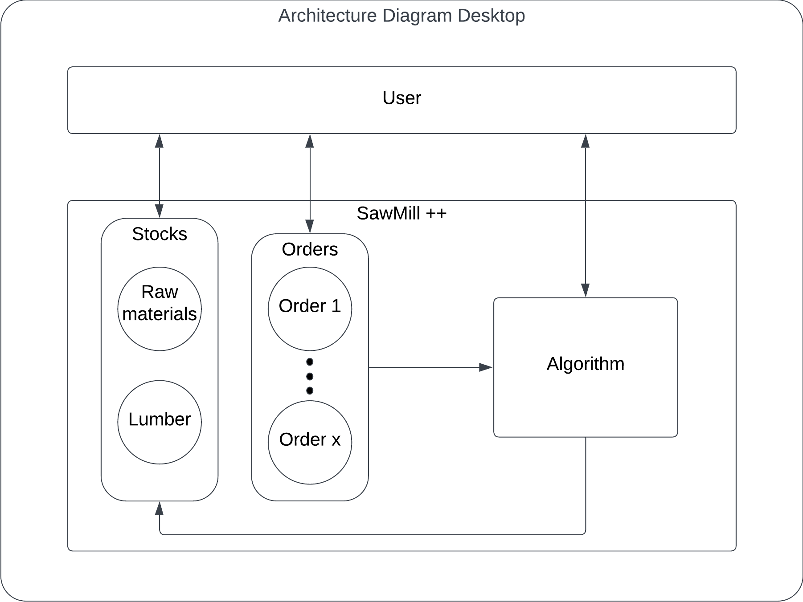
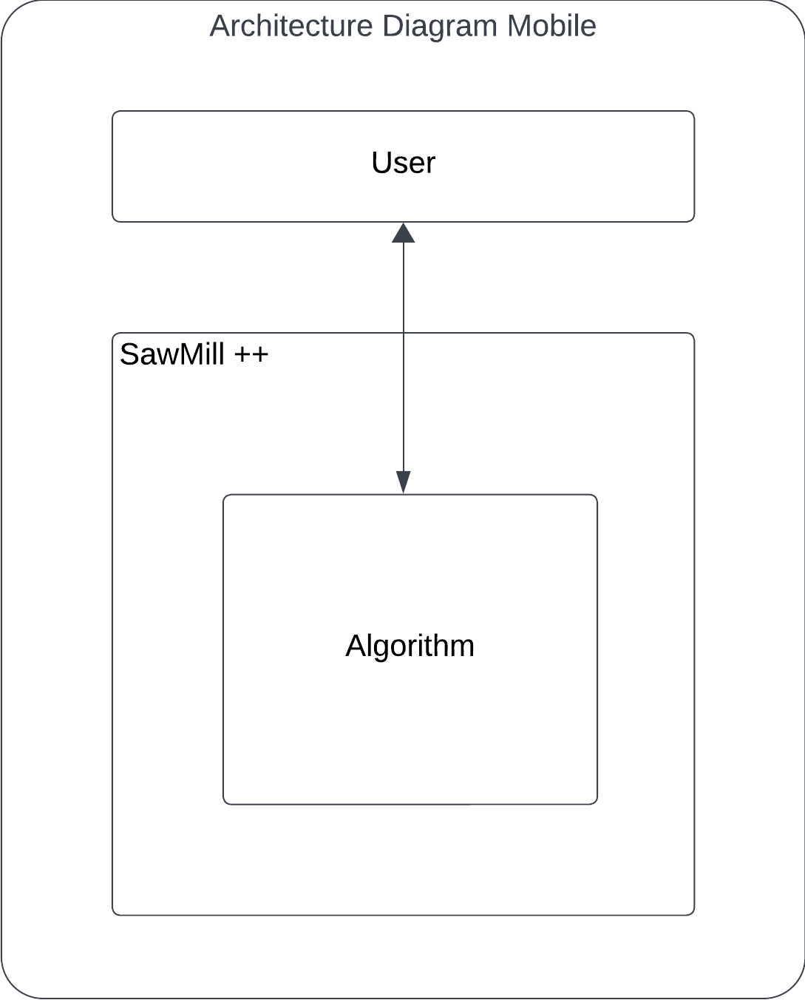
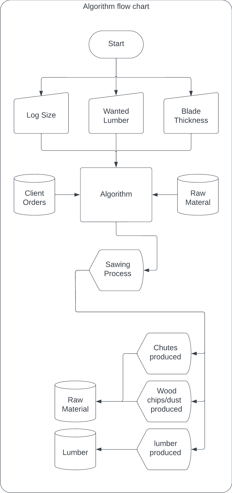
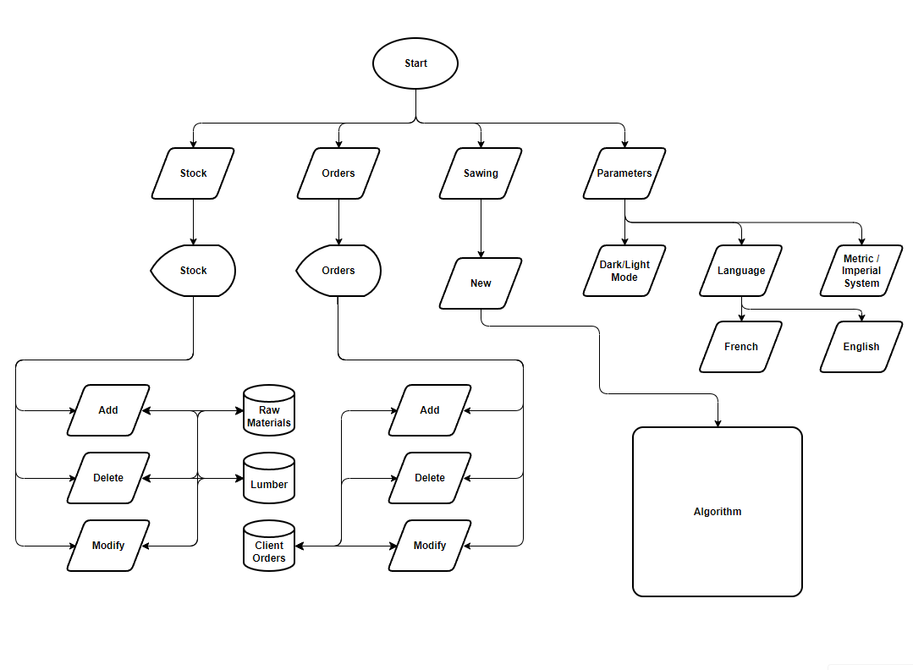
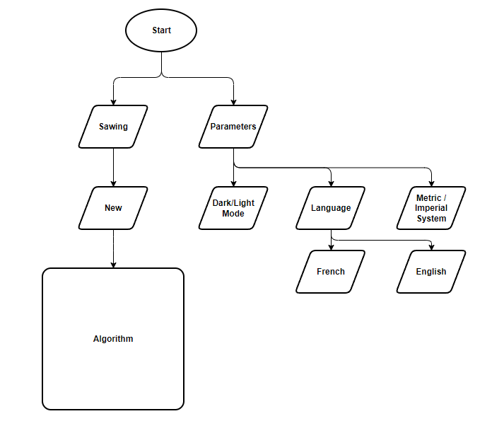

# <h1 align="center">Functional Specifications</h1>

created : 20/03/2023 last modified : 14/12/2023

Table of Content

1. [StackeHolders](#stackeholders)
2. [Context](#context)
3. [Target Audience](#target-audience)
4. [Features](#features)
5. [The Optimisation Algorythm](#the-optimisation-algorythm)
6. [Stock & Client's Orders Management](#stock--clients-orders-management)
7. [Mobile & Desktop Application](#mobile--desktop-application)
8. [Version Planning](#version-planning)
9. [Software Architecture Design](#software-architecture-design)
10. [User Interface / Experience](#user-interface--experience)
11. [Security](#security)
12. [Error Handling](#error-handling)
13. [Alerts](#alerts)
14. [Glossary](#glossary)

## <b>Stackeholders</b>

- ALGOSUP
- EIRL ML-Forests
- SawMill Companies
- ...

## <b>Context</b>

Small sawmills are often less efficient than their bigger counterparts, partially due to the fact that they use smaller and usually manual machinery which is more sensitive to human errors. This leads to a loss of potential income as more cuts mean more energy consumed (along with the tool's durability) and can also lead to the loss of part of the log which could have been used as lumber[1](#lumber).

Besides the financial losses this issue can cause, there is also an environmental issue as the unused wood will be further transformed (which means more energy cost) to be usable somewhere else while it could have been used as construction wood or any other lumber[1](#lumber).

To try and limit this, SawMill++ will help small and medium-sized sawmills by optimising as much as possible the process of sawing logs. From displaying the possibilities of sawing more lumber[1](#lumber) inside one log, to the following of the quantity of wood falls[2](#wood-falls) and Sawdust[3](#saw-dust). SawMill++ will allow sawmills to upgrade their efficiency and minimize their losses.

## <b>Target Audience</b>

Our Target audience will be small and medium-sized sawmills that work with small and manual machines as bigger sawmills already have similar software linked to heavy machinery. Yet bigger sawmills could be interested in our software depending on their specific situation.

## <b>Features</b>

- Give the process to saw a specified lumber[1](#lumber) in a given wood log (schematics & measurements)
    - Give the quantity of Sawdust[3](#saw-dust) and wood chips[4](#wood-chips) produced in the process (in cubic metres[5](#cubic-metre))
    - Give the quantity of wood falls[2](#wood-falls) produced in the process (in cubic metres[5](#cubic-metre))
    - Optimise the process of sawing to reduce the number of saw cuts and the quantity of wood falls[2](#wood-falls) as much as possible
- Keep track of the quantity of wood falls[2](#wood-falls) and wood chips[4](#wood-chips) / Sawdust[3](#saw-dust)
    - Add
    - Delete
    - Modify
    - Display
- Stock[*](#stock-management) Management
    - Add
    - Delete
    - Modify
    - Display
- Client’s orders Management
    - Add order
    - Delete order
    - Modify order
    - Display order (with order fulfilment using comparison to stock)
    - Use client’s orders to propose additional lumber[1](#lumber) choices in the sawing
- Give statistics 
    - Different usages of wood log in percentages
    - Different lumbers[1](#lumber) in stock
    - Different types of wood used/proposed
- Display "Alerts" for any stock (raw material, blades, wood falls, etc.) depending on a threshold set by the user.
- Parameters
    - Light / Dark mode
    - Language selection
        - French
        - English
    - Metric / Imperial system

###### Stock Management

Here "Stock" refers to raw materials, lumber and blades

## <b>The Optimisation Algorythm</b>

<b>
/!\ The following algorithm is only one way of doing the calculation, it may not be the best nor the most efficient of all as it is impossible to take into account the infinite number of variables in the shape of a wood log. People sawing wood should always verify that the output of this algorithm is possible in the specific case of the log they are sawing.
</b>  

### <b>Introduction:</b>

To create an optimised and as accurate as possible algorithm, we need to understand how wood sawing works. It can be divided into four steps which represent the four sides of the log you’re sawing. These steps can differ because there is more than one way to saw wood. We will limit ourselves to this specific method.

<b>Step 1:</b>
Your log is still round meaning you can’t saw at precise lengths. You need to do a first cut which will be the first wood fall (or loss)
Depending on the log, you may need to do a second (and eventually more) cut to be able to later turn the log to a straight face (to have a 90° angle on your lumber[1](#lumber)) this (or theses) cut(-s) can be resewed later to avoid throwing them out and get more lumber[1](#lumber) out of the log

<b>Step 2:</b>
Now that you have a straight face on your log, you can rotate it 90° and do the same again until you have an angle with no remaining bark.

<b>Step 3:</b>
Now you can rotate the log 90° again and you can start to cut at precise measurements since you have a straight face below.
Cut lumber[1](#lumber) until you’re left with the size of the last piece of lumber[1](#lumber) that you want (usually the bigger one)

<b>Step 4:</b>
Now you can rotate the log 90° one last time and cut your final sections until you have the piece you wanted

### <b>Exemple:</b>

*You want to make a piece of lumber[1](#lumber) that is 150x150mm in a log of diameter 600mm*

*Step 1: You cut the first pieces until you reach about 75 to 80% of the log (depending on the log’s shape)*

*Step 2: You rotate the log 90°. You cut until you have an angle with no bark left*

*Step 3: You rotate the log 90°. You have let’s say 480mm, you’ll need 150mm for the last piece you want, which leaves you with 330mm to work with to do other pieces (bark on top still remaining), you can divide it to see what you can do with it. In our example, we can do up to 15 planks of 18mm (remember to take into account the thickness of the blade in this example 4mm). Now you’re left with the log 150mm high and still one side with bark (around 480mm)*

*Step 4: You rotate the log 90°. You have again 480mm in height so you do the same as before and your planks are now directly cut to their final form and you’re left with your 150x150mm in the end*

*So in this example we were able to saw 1 150x150mm and up to 30 18x150mm in one log but with big losses in the corners.*

### <b>The Algorithm:</b>

The algorithm will take the seven following values as inputs:
- The log’s length (in mm)
- The log’s diameter at the foot (in mm)
- The log’s diameter at the head (in mm)
- The wood type 
- The height of the lumber[1](#lumber) we want (in mm)
- The width of the lumber[1](#lumber) we want (in mm)
- The thickness of the blade (in mm)
Alongside the table of wanted lumber[1](#lumber) (used to determine what to do with the remaining parts of the log).

With the three first values we can represent the log as follows.

[insert_log_representation]

Using the height and width of the wanted piece, we need to determine the procedure to saw that specific piece of lumber[1](#lumber) with the minimum number of cuts AND the least losses taking into account the thickness of the blade, the bark’s thickness, the percentage of the log usable and the table of wanted lumber[1](#lumber). The remaining wood which isn't usable will be saved as wood falls[2](#wood-falls). 

Using the wood density, the blade thickness and the number of cuts, we will determine the quantity of Sawdust[3](#saw-dust) produced by the operation.

As a reference, the log is always on even ground which means that if there is a difference between the two diameters, the two sides will be aligned on the floor as follows:

[insert_uneven_log_on_even_ground_representation]

In order to have a high quality and straight lumber[1](#lumber), we will do the calculation from the smaller side.

The wood type is needed to determine the thickness of the bark and the usable percentage for sawing.

The output of the algorithm will be the following:
- The process of sawing with the cuts their number and their position (detailed steps)
- A graphic representation of the said process
- The total number of cuts
- The outputted lumber[1](#lumber) (list with size in mm and number)
- The Sawdust[3](#saw-dust) produced (in cubic metres[5](#cubic-metre))
- The wood falls[2](#wood-falls) produced (in cubic metres[5](#cubic-metre))

## <b>Stock & Client's Orders Management</b>

Each stock will contain the following information:
- Name of the stock ("wood falls[2](#wood-falls)", "Sawdust[3](#saw-dust)", ...)
- Quantity (with the unit of measurement)

In the case of lumber[1](#lumber), each different lumber[1](#lumber) will be defined by:
- Width
- Height
- Length
- Quantity

In the case of client's orders, they will be defined by:
- Name of the client
- List of Lumber ordered
- Date Ordered
- Delivery Date

## <b>Mobile & Desktop Application</b>

The desktop application will contain every feature listed in this document and will be the main window for the user. 

Regarding the mobile version, it will only contain the one core feature of V 1.0. The point of the mobile application is to have the possibility to have the optimised sawing process without the need for a computer. It will be a smaller version of software, portable and easier to use. 

The two versions of the software may be able to communicate through a system of encrypted file exchange that could contain the following:
- Sawing procedures
- Stocks values
- Client’s orders

Concerning the supported Operating systems, the software will run on Windows and MacOS for the desktop version, and on Android and iOS for the mobile version.

## <b>Version Planning</b>

### V 1.0:

The first version of the software will only contain the computer version and the following core features:
Give the process to saw a specified lumber[1](#lumber) in a given wood log (schematics & measurements)

### V 2.0:

The second version of the software will contain the mobile app version of the software with improvements and bug fixes for the core feature of the computer version along with the following secondary features:
- Give statistics 
- Keep track of the quantity of wood falls[2](#wood-falls) and wood chips[4](#wood-chips) / Sawdust[3](#saw-dust)
- Keep track of stock
- Keep track of client’s orders

### V 3.0 & +:

As of today, there are no plans for versions of the software above version 2.

## <b>Software Architecture Design</b>

### Desktop Application

### Mobile application

## <b>User Interface / Experience</b>

### Interface

Every aspect of the UI is subject to changes as user surveys will be conducted and used to improve the design and the UX.

Needs:
- Overall aspect of the application (desktop and mobile version)
- Aspects of parameters
- Aspects of sawing process (outputted by the algorithm)
- Aspects of stocks
- Aspects of orders
- Aspects of the main screen

### FlowCharts

#### Algorithm

#### Desktop

#### Mobile

## <b>Security</b>

Regarding the security of the software, all data and calculations will be stored locally and will be encrypted to avoid any leaks. This means that the software won’t need the internet and will be able to operate without access to a network. 

In the event of a leak, the data stored are the following:
- Stocks
- Raw material
- lumber[1](#lumber)
- Sawdust[3](#saw-dust)
- wood falls[2](#wood-falls)
- Client’s orders

Since the client's/customer's information will only be a name and the quantity of product ordered, the risk stays very low as those two pieces of information are of no use without further context.

Concerning the stocks, this information is of no use to anyone without the context of the company/sawmill owning the stock, and even with that specific context, that information is no threat to the company since their stock would most likely be visible by their potential clients or accessible through any contact to the company (phone, website, …).

## <b>Error Handling</b>

The software will contain a solution for error handling that will, in defined and common cases, display the source of the error and tips to restore the software functionality so that the user can resolve the issue himself and avoid calling a technician.
Said error will include:
- Wrong inputs
- Known potential errors in the Algorithm

## <b>Alerts</b>

This section is related to the stock management feature.

The software will display alerts when certain stocks get above or below the threshold set by the user. The user will have access to parameters to set what is considered a low (or high) threshold for each stock (a bigger sawmill may consider 20 blades as low when a smaller one will never have that much). When the stock gets above or below the parameter set by the user, the software will simply display an alert “Low blade stock” or “High wood-dust stock”.

The alerts will be an optional feature that the user can activate on specific stocks, represented as a check box on the stock management page. Alerts will be displayed on the main screen of the software.

## <b>Glossary</b>

### Lumber:

Lumber is wood that has been processed into uniform and useful sizes (dimensional lumber), including beams and planks or boards. Lumber is mainly used for construction framing, as well as finishing (floors, wall panels, window frames).

### Wood Falls:

Wood falls define part of the log that is unusable as lumber after cutting mainly the rounded part of the log.

### Sawdust:

Wood dust produced by the blade when cutting.

### Wood Chips

Wood chips are basically small parts of wood produced by the action of cutting, depending on the blade and method, wood chips can be bigger or smaller, or eventually just sawdust.

### Cubic metre

The cubic metre or cubic meter is the unit of volume in the International System of Units. Its symbol is m3. It is the volume of a cube with edges one metre in length.

### Stere

A stere is a measurement unit for wood quantities, it is remarkable by its changing way of calculations depending on the length of the wood logs, for instance for logs that are 1m long 1 stere = 1 cubic metre but if the wood logs are 50 cm long, then 1 stere = 0.8 cubic metre.

### UI

UI refers to the user interface. It is the interface of software through which the user can interact/communicate with the software.

### UX

UX refers to user experience. It is a broad term defining the experience of the user throughout the usage of software (It is usually related to UI).
