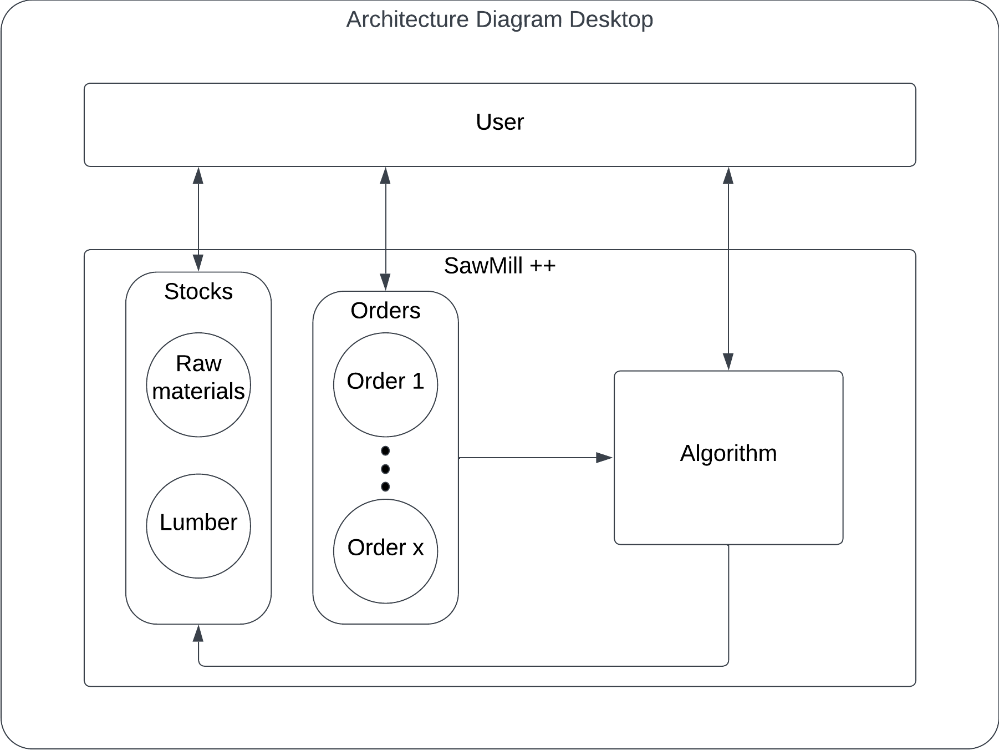
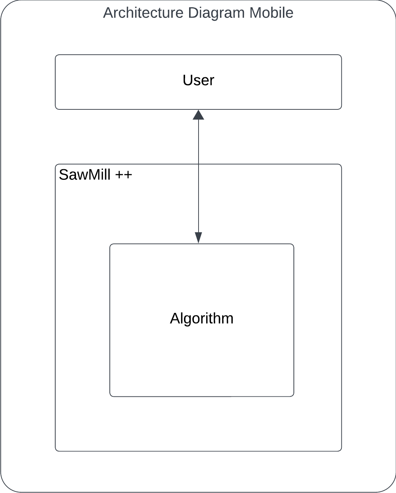

# <h1 align="center">Technical Specifications</h1>

created : 10/07/2023 last modified : 28/05/2024

Table Of Content

- [Introduction](#introduction)

# Introduction

## Overview

As stated in the Functionnal Specifications, this project has for objective to create a small software for small and medium sized sawmills to help them optimise the process of sawing wood and minimise their losses by providing an algorithm which given certain parameters will output a detailed and optimised sawing process.

This software will also propose a management tool for stocks and clients' orders to ensure the best possible optimisation of the sawing processes.

## Technical Requirements

To ensure that our software will be widely used, it will be compatible with the most common operating systems both on desktop computers and mobile phones.

### Desktop

| OS | OS Version |
| ---- | ---- |
| MacOS | 14+ |
| Windows | 7+ |

### Mobile

| OS | OS Version |
| ---- | ---- |
| Android | 13+ |
| IOS | 17+ |

## Developement Environment

Considering the size of this project and the timeframe in which it will be conducted, there will be two different environments in which it will be developed.

| OS | MacOS Sonoma 14.2.1 | Windows 10 |
| ---- | ---- | ---- |
| Processor | Apple M1 | Intel i7 6700 |
| RAM | 8 Gb | 16 Gb |
| Graphic Processor | Apple M1 | Nvidia GTX 1660ti |

## Constraints

Time - The timeframe of the project maybe wide but as always we need to stay alert on deadlines and milestone to ensure good progression and that the delivery will be on time

There are no specific constraints other than time on this project, 

# Solution

## Technologies

For this project, we will use Unity and C# to create our software. The choice came down to Unity because it allows us to easily integrate a User Interface and export the software in different formats compatible with our required operating systems (Computer or Mobile). Furthermore, I personally have quite a bit of experience with Unity, thus avoiding the need to learn how to use it, saving time and allowing faster development.

We will use Unity version `2021.3.24f1` as it is an LTS (Long Term Support) version compatible with both MacOS and Windows.

We will use Visual Studio Code and Visual Studio Community as IDEs. Using whichever one is better for the specific operating system we are working on.

## Conventions

### File

folder structure:
- Folder for all scripts
- Folder for all UI
- File names in PascalCase

### Coding

variables -> snake_case  
Functions -> PascalCase

### Comments

- Each function needs at least one comment explaining its purpose.
- Each complex formula must have a simplified version in comment along with purpose explaination.

## Architecture Diagram

### Desktop

### Mobile

## Algorithm

### Classes:  
Lumber -> Width and height and wood type 
SawCut -> PointA and PointB
WoodType -> enum

### Inputs:

|Name                           |Unit           |Type of variable|
|-------------------------------|--------------:|----------------|
|Log's Length                   |mm             |`float`         |
|Log's Diameter at the foot     |mm             |`float`         |
|Log's Diameter at the head     |mm             |`float`         |
|Wood type                      |name           |`enum`          |
|Wanted Lumber Height           |mm             |`float`         |
|Wanted Lumber Width            |mm             |`float`         |
|Blade thickness                |mm             |`float`         |
|Additional lumber table        |Table of lumber|`List<Lumber>`  |
|Discovery plank height         |mm             |`float`         |
|Do we repeat the wanted Lumber |Checkbox       |`bool`          |

### Fonctionning

We will use a list of SawCuts (`List<SawCut>`) to store the result of the algorithm throughout its execution. The execution will be devided into the four sides of the log (as described in the functional specifications).

As stated in the functional specifications if the log's diameter at the foot and head are different we will use the smallest one.

- side 1: Starting from the top, we make saw cuts the height of the discovery plank until we reach 80% of the log's diameter.
- side 2: Starting from the right, we make saw cuts the width of the discovery plank until we reach the last cut from side 1.
- side 3: 
    - We calculate what is remaining between the bottom (here bottom refers to the angle with the last cut from side 2, the round end at the bottom will be passed as discovery planks) and the last cut from side 1.
    - If the user wants to repeat the wanted lumber, then we divide the remains by its height.
    - Else we substract the height of the wanted lumber from the top (last cut from side 1) and divide by the best possible lumber height available in the additional lumber table. We also save the additional lumber used for next side.
- side 4:
    - We calculate what is remaining between the left (here left refers to the actual maximum left part of the log) and the last cut from side 2.
    - If the user wants to repeat the wanted lumber, then we divide the remains by its width.
    - Else:
        - We divide the part bellow the wanted lumber height by the width of the saved additional lumber.
        - We substract the width of the wanted lumber from the right (last cut from side 2) and divide by the best possible lumber width available in the additional lumber table (where the height is the same as the wanted lumber).

Finaly we determine how many of each additional lumber we were able to produce in that log along with the one wanted lumber. (each corner of the additional lumber needs to be in the "circle" representing the log for it to be considered complete and added to the count).

> [!caution]  
> To determine the best possible lumber in the additional lumber table you look at what would remain after the division(on width or height). For the second version of the software the client's orders will also determine what additional lumber is needed.

- To calculate the saw dust produced, each saw cut can be represented as a 3D shape with those values:
    - Width -> Distance between the two points of the cut
    - Height -> blade thickness
    - Depth -> log's lenght  

With this we calculate the quantity(volume in cubic meter) of saw dust produced.

- To calculate the wood falls produced, you calculate the total volume of the log and substract from it the volume of lumber sawed and saw dust produced.

### Outputs:

|Name                           |Unit           |Type of variable           |
|-------------------------------|---------------|---------------------------|
|The sawing process             |Graphical      |`List<SawCut>`             |
|The total number of cuts       |Decimal number |`int`                      |
|The outputed Lumber            |Lumber         |`Lumber`                   |
|The outputed additional Lumber |Lumber table   |`List<Tuple(Lumber, int)>` |
|The produced wood falls        |cubic meter    |`float`                    |
|The produced saw dust          |cubic meter    |`float`                    |

## Stock / Clients' orders Management

To store the clients' orders we will use files as it is easier and faster to implement. We will also use a .csv file.

## Error Handling

The software will be able to detect wrong inputs in text fields. In that case the software will display a window with the error and its cause while stoping the algorithm form running further calculations. The following errors will be handled:

|Name             |Cause                                                              |How to fix it                    |
|-----------------|-------------------------------------------------------------------|---------------------------------|
|Wrong Input      |An input is outside its range or in the wrong format               |Change input                     |
|Algorithm failure|The algorithm has encountered a failure due to unexpected behaviour|Try again with a different input |

New errors may be added in the future according to user testing and resturns.

## Alerts

The alert system will work with a parameter that can be set by the user in the settings. Each stock type should have a corresponding alert. Once the stock value goes above or bellow the threeshold set by the user, an alert will be displayed on the main screen in the reserved area.

# Further Considerations

## Accessibility

available on mac and window for desktop
on android and ios for mobile

## Risks & Assumptions

time constrain
algorithm complexity

# Sucess Evaluation

## Metrics

- algorithm works
- software handle common errors
- save and load data for stocks

## User Feedback

This software will be heavely tested by users, in the case that a significant portion of those said users are satisfied with the functionalities and state of the software, it will be considered a success.

# Work

## Prioritisation

1. algorithm
2. UI
3. Parameters
4. Stock managment
5. Alerts
6. Statistics

## Milestones

1. Algorithm(simplified) 
2. First Desktop Version
3. Algorithm(Advanced) working
4. First Mobile version

# End Mater

## References

- [Functional Specifications](../Documents/FunctionalSpecifications.md)
- [Test Plan](../Documents/TestPlan.md)

## Glossary

### Operating System

### Unity

### C#

### User Interface

### Long Term Support (LTS)

### CSV extension